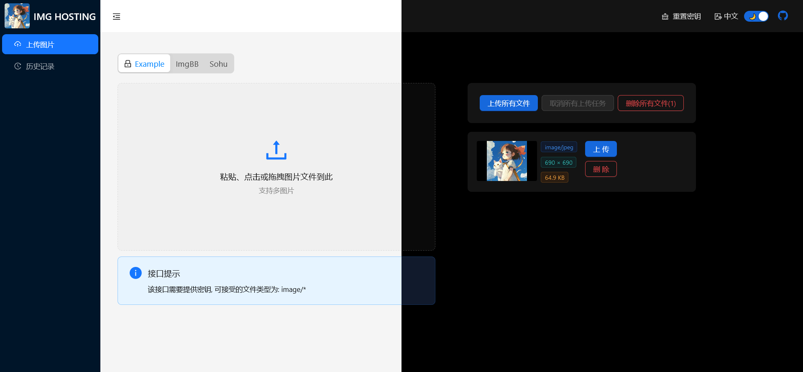

<div align="center">

</div>

# IMG HOSTING

[](https://www.typescriptlang.org/)
[](https://react.dev/)
[](https://reactrouter.com/)

一个关于图片托管(图床)的通用前端程序，支持深色模式和国际化。

[English](./README.md) | 中文

## 技术栈

Typescript + React18(Hooks) + React-Router v6(Data Api) + [Zustand](https://github.com/pmndrs/zustand) + [React-i18next](https://github.com/i18next/react-i18next) + [Ant Design](https://github.com/ant-design/ant-design) + [Vite](https://vitejs.dev/)

## 安装

```bash
npm install
npm run dev
# start a simple example server to handle uploaded images, auth key is "example"
npm run serve

# build using vite
npm run build
```

## 接口添加

在`src/apis`目录下新建 ts 文件,导出实现`UploadApi`接口的对象，你可以在已有的接口文件中学习到更多。

关于服务端的构建，请查看`example/server.js`文件中的简单案例作为参考。

```typescript
type UploadRequest = {
    method?: "GET" | "POST" | "PUT" | "DELETE" | string;
    url: string;
    body: any;
    headers?: HeadersInit;
    /** auto parse response according to type */
    responseType?: "json" | "text";
};

type UploadResult = {
    success: boolean;
    message?: string;
    url: string;
    unauthorized?: boolean;
};

interface UploadApi<T = any> {
    title: string;
    /** unique key */
    name: string;
    /** maximum bytes */
    maxSize?: number;
    /** default "image/*" */
    accept?: string;
    /** sort according to the value */
    order?: number;
    /** self hosted APIs maybe require authkey */
    handleAuthKey?: (key: string) => string | Promise<string>;
    disabled?: boolean;
    /** sync/async */
    buildRequest: (args: {
        file: File;
        md5Hash: string;
        authKey?: string;
    }) => UploadRequest | Promise<UploadRequest>;
    /** sync/async */
    resolveResponse: (
        response: HttpResponse<T>,
        authKey?: string
    ) => UploadResult | Promise<UploadResult>;
}
```

## License

[GPL-3.0](./LICENSE) © Ayouth
